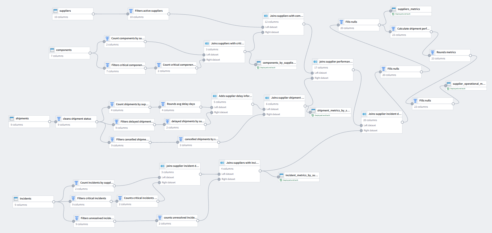

# Industrial Foundry Platform

Industrial data platform inspired by the Palantir Foundry ecosystem for manufacturing and operational environments.

The goal of this project is to build a modular industrial platform capable of integrating operational data, applying business logic, and delivering data products that support industrial decision making.

---

## Vision

This project explores practical Data Engineering concepts through realistic industrial use cases, including:

- Industrial data integration
- Business data modeling
- Pipeline orchestration
- Operational analytics
- Ontology-driven design
- Business applications
- Manufacturing scenarios

---

## Current Development

The first module of the platform focuses on **Supplier Operational Risk** and is currently being developed through a modular Pipeline Builder workflow.

The current Pipeline Builder workflow integrates multiple industrial datasets and progressively transforms them into operational metrics that will support future business applications.

Current datasets:

- Suppliers
- Components
- Shipments
- Incidents
- Plants

Current capabilities:

- Multi-source data integration
- Modular Pipeline Builder workflows
- Supplier operational metrics
- Shipment analytics
- Component analytics
- Incident analytics
- Data quality and validation logic

---

## Future Modules

The platform is designed to grow over time.

Planned areas of development include:

- Supplier performance
- Operational risk scoring
- Manufacturing KPIs
- Ontology
- Workshop applications
- Actions
- Additional industrial use cases

---

## Tech Stack

Palantir Foundry • Pipeline Builder • PySpark • SQL • Ontology • Workshop

---

## Status

🚧 Active development.

This is a long-term portfolio project that evolves incrementally by adding new industrial use cases and platform capabilities.

---

## Disclaimer

This is a personal portfolio project created for learning and professional development.

It does not contain confidential company information or proprietary business data.