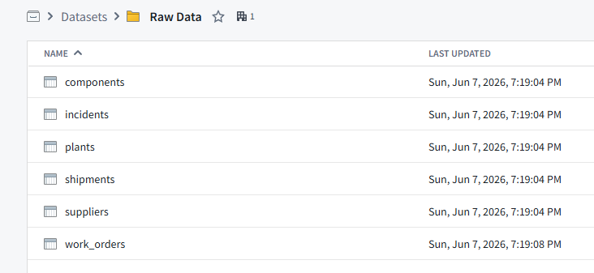
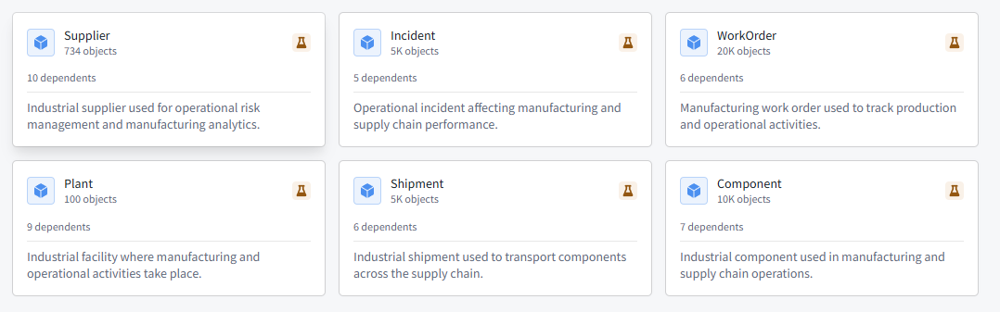
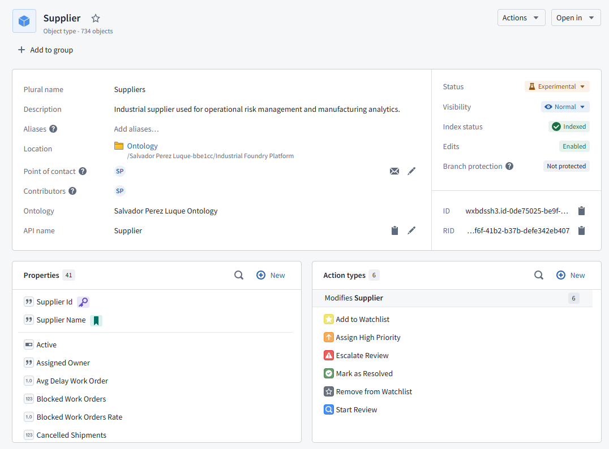
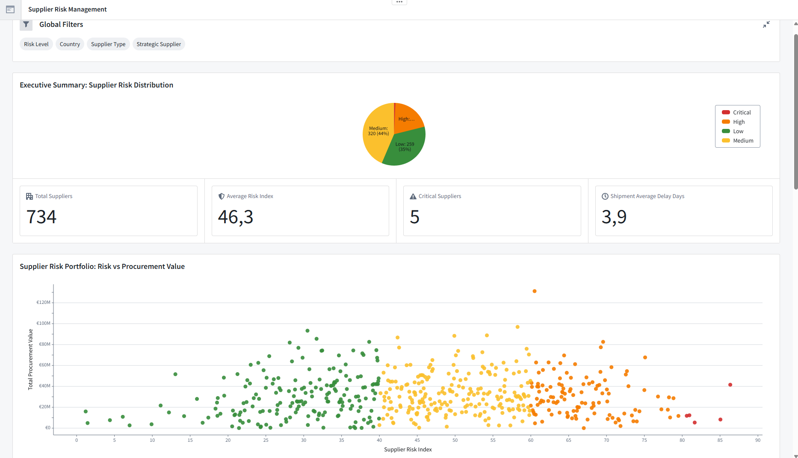
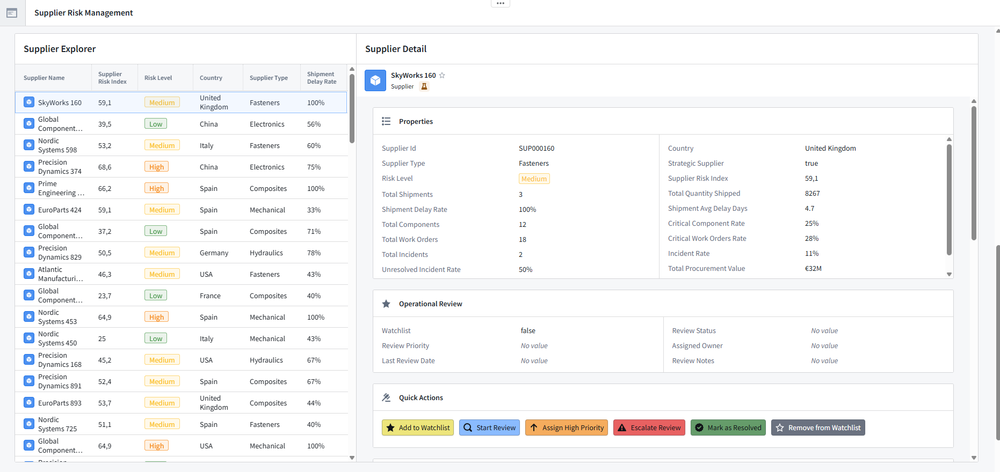
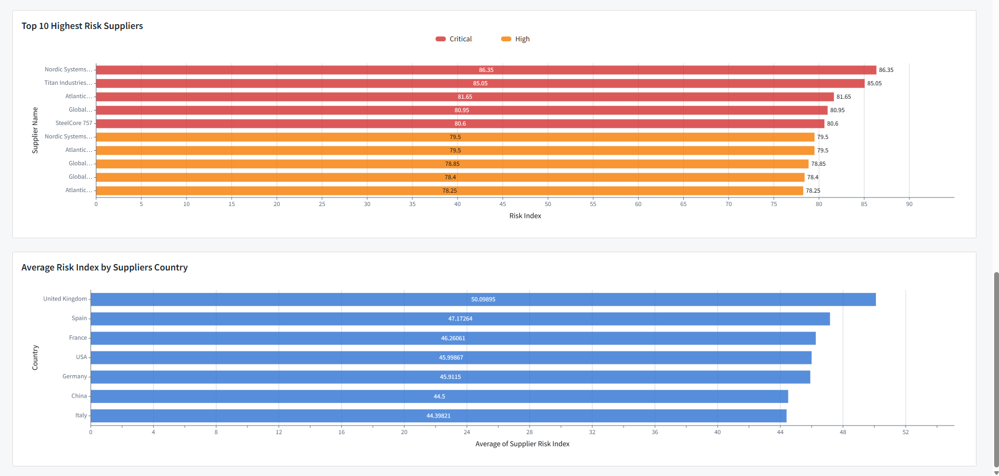

# Industrial Foundry Platform

Industrial data platform inspired by the Palantir Foundry ecosystem for manufacturing and supply chain environments.

The goal of this project is to build a realistic end-to-end industrial platform that integrates operational data, models business entities through Ontology, and delivers operational applications used to support industrial decision-making.

Rather than building isolated demos, the platform evolves module by module on top of a shared industrial data foundation.

---

# Vision

This project demonstrates how modern Data Engineering extends beyond data pipelines by combining:

- Industrial data integration
- Business data modeling
- Pipeline orchestration
- Ontology
- Operational applications
- Business workflows
- Manufacturing use cases

Supplier Risk Management is the first business module of a larger industrial platform that will continue expanding over time.

---

# Platform Architecture

Current industrial data foundation:

- Suppliers
- Components
- Plants
- Shipments
- Work Orders
- Incidents

All datasets are connected through realistic business relationships and support a shared industrial Ontology.

---

# Pipeline Builder

The first business module implements a complete Supplier Risk aggregation pipeline.

The workflow combines multiple industrial datasets to calculate supplier-level operational KPIs including:

- Supplier Risk Index
- Risk Level
- Shipment Delay Rate
- Average Shipment Delay
- Critical Component Rate
- Incident Rate
- Unresolved Incident Rate
- Critical Work Orders Rate
- Procurement Value
- Operational metrics

The pipeline demonstrates:

- Multi-source joins
- Aggregations
- Business logic implementation
- Data quality handling
- Null management
- Derived KPIs
- Production-style transformations

---

# Ontology

The project includes a shared industrial Ontology representing the business domain.

Current Object Types:

Business relationships are modeled through Ontology Links, enabling navigation across the industrial domain.

Lynk Types:

- Components → Supplier
- Incidents → Supplier
- Shipments → Component
- Shipments → Plant
- Work Orders → Component
- Work Orders → Plant

The Supplier Object Type combines operational, quality and supply chain KPIs with business-friendly formatting and Object Views.

In addition, the Ontology now includes operational review properties maintained directly by business users through Ontology Edits:

- Watchlist
- Review Status
- Review Priority
- Assigned Owner
- Last Review Date
- Review Notes

This separates analytical metrics generated by data pipelines from operational information maintained by end users.

---

# Operational Workflow

The platform now includes a first operational workflow implemented using Ontology Actions.

Available actions include:

- Add to Watchlist
- Remove from Watchlist
- Start Review
- Assign High Priority
- Escalate Review
- Mark as Resolved

These actions automatically update operational review properties directly within the Ontology, demonstrating how business workflows can be integrated into operational applications.

---

# Workshop Application

A complete operational application has been built on top of the Ontology.

## Supplier Risk Management

Current capabilities include:

- Executive KPI dashboard
- Global interactive filters
- Supplier Risk Distribution
- Supplier Risk Portfolio (Risk vs Procurement Value)
- Supplier Explorer
- Supplier Detail Object View
- Operational Review panel
- Related Objects navigation
- Top 10 Highest Risk Suppliers
- Country Risk Analysis
- Cross-filtering across all visualizations

The Supplier Detail view combines analytical KPIs with operational information and allows users to execute business actions directly from the application.

Quick Actions currently include:

- Add to Watchlist
- Start Review
- Assign High Priority
- Escalate Review
- Mark as Resolved
- Remove from Watchlist

The application also demonstrates Ontology navigation through related Components, Shipments, Work Orders and Incidents.

### Executive Dashboard

### Supplier Explorer & Operational Review

### Operational Analytics

---

# Roadmap

The platform evolves incrementally while reusing the same industrial data foundation and shared Ontology.

Current roadmap:

- ✅ Supplier Risk Management
- ⏳ Supplier Performance Analytics
- ⏳ Manufacturing Operations Monitoring
- ⏳ Logistics & Shipment Intelligence
- ⏳ Quality Management
- ⏳ Shared Enterprise Ontology
- ⏳ Additional Workshop Applications
- ⏳ Actions & Operational Workflows
- ⏳ AIP-Powered Use Cases

---

# Tech Stack

**Palantir Foundry**

- Pipeline Builder
- Ontology
- Ontology Manager
- Ontology Actions
- Workshop
- Data Lineage

**Data Engineering**

- PySpark
- SQL
- Industrial Data Modeling
- Business Logic
- KPI Engineering

---

# Status

🚧 Active development.

This project is being developed as a long-term industrial platform that progressively incorporates new business modules, operational workflows and enterprise data capabilities.

---

# Disclaimer

This is a personal portfolio project created for learning and professional development.

It does not contain confidential company information or proprietary business data.